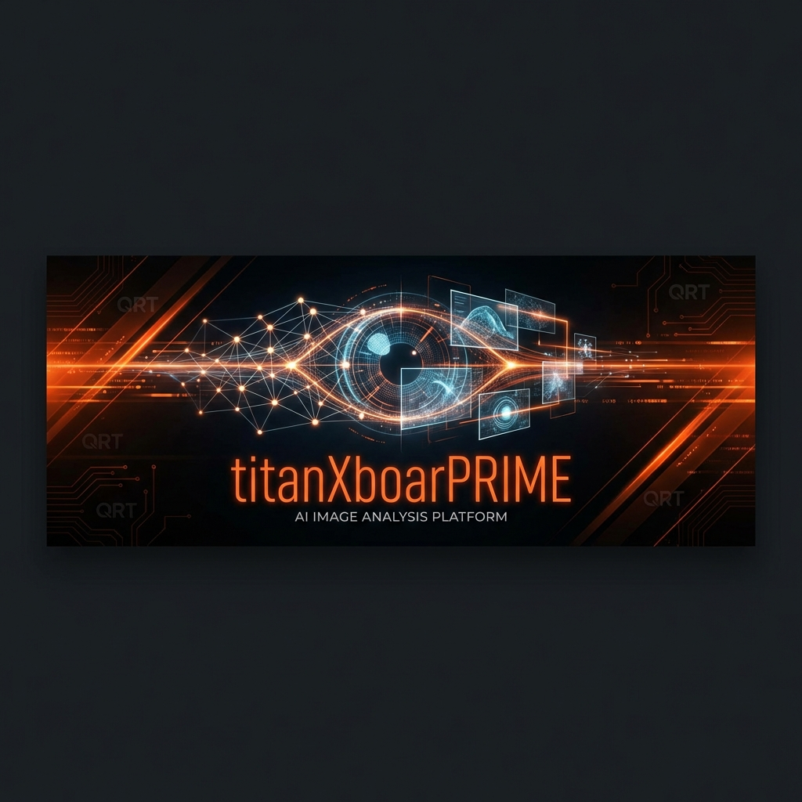
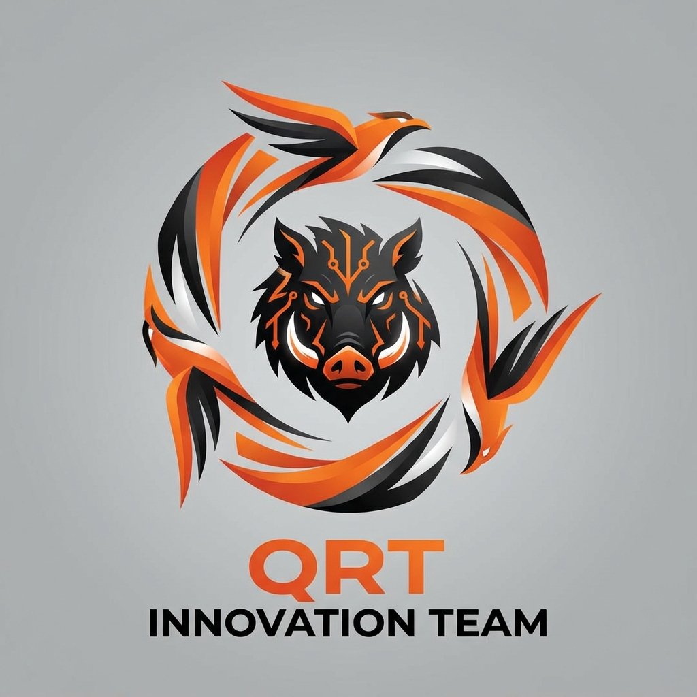

<div align="center">





# titanXboarPRIME

**AI-Powered Image Analysis Platform**

[](https://github.com/QRTInnovation/titanXboarPRIME)
[](./LICENSE)
[](https://github.com/QRTInnovation/titanXboarPRIME)

*High-performance image analysis and description suite powered by Quick Red Tech's advanced AI models. Built for rapid visual intelligence on the go.*

[Features](#features) • [Installation](#installation) • [Usage](#usage) • [Development](#development) • [Contact](#contact)

</div>

---

## 🚀 About

**titanXboarPRIME** is a cutting-edge AI image analysis platform developed by the **QRT Innovation Team**. Our software leverages state-of-the-art machine learning models to provide:

- 🔍 **Deep Image Analysis** - Comprehensive visual understanding and description
- 🌐 **Internet Trace Detection** - Discover where images appear across the web through crawled sites
- 💾 **Local Caching** - Store analysis results on your device for offline access
- 🔒 **Enterprise Security** - Protected codebase with authorization controls
- ⚡ **Rate-Limited API** - Fair usage with 3 images per 5-minute window
- 💬 **Interactive Q&A** - Ask questions about analyzed images

---

## 📖 Project History

### The Journey

**titanXboarPRIME** has been a labor of innovation and perseverance:

- **Early 2023** - Initial development began with ambitious goals for AI-powered image analysis
- **Mid 2023** - Project paused due to encountered technical challenges and bugs
- **2025** - Development resumed with renewed focus; some experimental features were abandoned to streamline the core product
- **Early 2026** - Breakthrough! A comprehensive solution was developed, leading to our **first beta release**

Today, titanXboarPRIME represents the culmination of years of research, development, and refinement by the QRT Innovation Team.

---

## ✨ Features

### Core Capabilities

- **🎯 Advanced Image Recognition** - Powered by Google's Gemini AI models
- **📝 Detailed Descriptions** - Generate comprehensive, context-aware image descriptions
- **🔎 Web Trace Discovery** - Find instances of images across indexed websites
- **📊 Analysis History** - Track and review past analyses
- **🎨 Modern UI** - Sleek, responsive interface with dark mode
- **📱 Mobile-First Design** - Optimized for all devices

### Professional Features

- **🍪 Cookie Consent Management** - GDPR-compliant user consent system
- **⏱️ Smart Rate Limiting** - 3 images per 5 minutes to ensure fair usage
- **💾 Client-Side Caching** - Store results locally for faster access
- **🔐 Code Protection** - Unauthorized modifications prevented
- **👥 Access Control** - Managed by QRT Innovation Development Management Team

---

## 🛠️ Installation

### Prerequisites

- **Node.js** (v16 or higher)
- **npm** or **yarn**
- **Gemini API Key** from [Google AI Studio](https://ai.google.dev/)

### Quick Start

1. **Clone the repository**
   ```bash
   git clone https://github.com/QRTInnovation/titanXboarPRIME.git
   cd titanXboarPRIME
   ```

2. **Install dependencies**
   ```bash
   npm install
   ```

3. **Configure API Key**
   
   Set your `GEMINI_API_KEY` in the `.env.local` file:
   ```env
   GEMINI_API_KEY=your_api_key_here
   ```

4. **Run the development server**
   ```bash
   npm run dev
   ```

5. **Open your browser**
   
   Navigate to `http://localhost:5173`

---

## 💻 Usage

### Analyzing Images

1. **Upload an Image** - Click the upload area or drag & drop
2. **Wait for Analysis** - AI processes your image (typically 2-5 seconds)
3. **Review Results** - View detailed descriptions and insights
4. **Ask Questions** - Interact with the AI about the image
5. **Check History** - Access past analyses anytime

### Rate Limits

- **3 images per 5 minutes** per user
- Limits reset automatically
- Local caching allows unlimited re-viewing of past analyses

---

## 🏗️ Development

### Project Structure

```
titanXboarPRIME/
├── assets/              # Logos, banners, and images
├── components/          # React components
│   └── Layout.tsx       # Main layout component
├── services/            # API and business logic
│   └── geminiService.ts # Gemini AI integration
├── App.tsx              # Main application
├── index.html           # HTML entry point
├── index.tsx            # React entry point
├── types.ts             # TypeScript definitions
└── vite.config.ts       # Vite configuration
```

### Tech Stack

- **Frontend**: React 19, TypeScript
- **Styling**: TailwindCSS, Custom CSS
- **AI**: Google Gemini API
- **Build Tool**: Vite
- **Fonts**: Space Grotesk, JetBrains Mono

### Building for Production

```bash
npm run build
```

The optimized build will be in the `dist/` directory.

### Preview Production Build

```bash
npm run preview
```

---

## 🔒 Code Protection & Authorization

> [!WARNING]
> **Unauthorized Modifications Prohibited**
> 
> This codebase is protected and managed by the **QRT Innovation Development Management Team**. Modifications, redistributions, or derivative works require explicit written authorization.

### Requesting Access

To request development access or report issues:
- Email: **quicredtech@gmail.com**
- Subject: "titanXboarPRIME Development Access Request"

---

## 🤝 Contributing

We appreciate your interest! However, contributions are currently limited to authorized QRT Innovation Team members. 

If you'd like to contribute:
1. Contact us at **quicredtech@gmail.com**
2. Describe your proposed contribution
3. Wait for authorization from the Development Management Team

---

## 📄 License

**Proprietary Software** - © 2023-2026 QRT Innovation Team

This software is proprietary and confidential. Unauthorized copying, modification, distribution, or use is strictly prohibited without explicit written permission from the QRT Innovation Development Management Team.

---

## 📞 Contact & Support

### QRT Innovation Team

- **Email**: quicredtech@gmail.com
- **Project**: titanXboarPRIME
- **Version**: 0.0.0.1-boarbetaVX (Beta)

### Reporting Issues

Found a bug? Have a suggestion?
- Email us with subject: "titanXboarPRIME - [Issue/Suggestion]"
- Include steps to reproduce (for bugs)
- Attach screenshots if applicable

---

## 🙏 Acknowledgments

- **Google Gemini AI** - For powerful image analysis capabilities
- **QRT Innovation Team** - For dedication through years of development
- **Beta Testers** - For valuable feedback and support

---

<div align="center">

**Built with ❤️ by QRT Innovation Team**


*Empowering visual intelligence through innovation*

</div>
